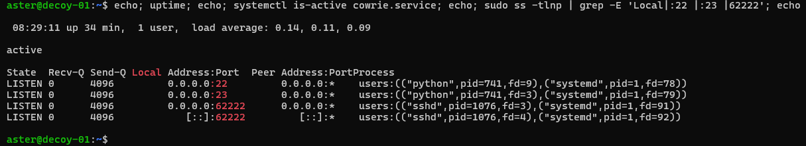

# Build log
A step-by-step record of everything I did for the setup, since tis is all configurations, no code.
Bloopers included

## The machine

| | |
|---|---|
| Provider | Microsoft Azure (Azure for Students — $100 credit, academic email, no card) |
| Region | Austria East |
| Size | B2ats_v2 (2 vCPU, 1 GB RAM, ARM) |
| Disk | Premium SSD P6 |
| OS | Ubuntu 24.04 LTS |
| Security type | Trusted launch, integrity monitoring on |
| Public IP | Static, so the address does not change mid-collection |
| Resource group | `deception-grid` — everything is inside it, so teardown is a single step |

Only one machine and both decoys sit behind the same address. This is so thtthe IT-door and 
OT-door traffic are directly comparable. Two machines would mean two different addresses with 
two different discovery histories, which is apples to orages.

## Mistakes made

**Hetzner abandoned.** Chosen because it waas the cheapest. It wanted my credit card details and then asked for a €25
deposit for 'identification' (!?!), so I stopped and and looked for alternatives

**The Azure for Students "free VM" offer is Windows Server only.** I have a student email, and want to do the Azure certs as well.
Its image list has no Linux in it, so chose Ubuntu 24.04 undert he
*Create a virtual machine* flow. $100 free student credit.

**Tried multiple regions before one worked.** Germany West Central had no B-series
capacity. Sweden Central was refused by the subscription's own region policy.
Austria East worked. About 40 minutes lost D':.

## The admin address problem

Discovered the morning after the build: SSH timed out. Nothing was wrong with
the machine - the admin rule allows exactly one source address, and a
residential connection had been given a new one overnight.

The two addresses were not neighbours. They sat in unrelated ranges, which
rules out the obvious fix of allowing the provider's block. Time to diagnose,
knowing what to look for: about 20 minutes. "Timed out" rather than "refused"
was the clue that mattered - a refusal means the host answered, a timeout
means nothing did.

The choice was between three options: rewrite the rule each session, widen it
to something permanent and looser, or automate it. Automating it keeps the
strictest version of the control and removes the operational cost that would
eventually have argued for weakening it. See `scripts/allow-me.ps1`.

A control that is expensive to comply with gets bypassed, and the bypass is 
usually invisible until something goes wrong. Thecheapest way to keep a strict
rule is to make obeying it take one command.

## The decoys

Cowrie `3.0.16.dev4+g9dc1ea8f3`, cloned from `main` on 25 September 2026. The
commit is recorded because a version number alone would not let anyone repeat
this.

Installed under a dedicated `cowrie` user with no password, no `sudo` and a
single group. The account was removed from the `users` group that `adduser`
adds by default, after checking that nothing on the machine was owned by that
group — a group is only a privilege if something belongs to it. The one
program here that exists to be attacked is the one with the least to escape
into.

Three things about this project's layout have moved since most guides were
written, and each cost time:

- Defaults live at `src/cowrie/data/etc/cowrie.cfg.dist`, not `etc/`.
- There is no `bin/cowrie`. The launcher is a console script declared in
  `pyproject.toml`.
- `pip install -r requirements.txt` installs what Cowrie depends on. It does
  not install Cowrie. `pip install -e .` is a separate, necessary step, and
  editable so a later `git pull` takes a security fix without reinstalling.

### Configuration is two small files, not an edited copy

`etc/cowrie.cfg` holds only what differs from the shipped defaults. The
defaults are never edited in place: a `git pull` would overwrite them and take
the changes with it. It sets two things — the hostname, because Cowrie's
shipped `svr04` is a known fingerprint visible on every prompt, and telnet,
which ships disabled.

`etc/userdb.txt` names the five credentials the decoy accepts: `root` with
`123456`, `password`, `admin`, `1234` or `root`, and nothing else. Two denial
rules above them refuse the self-referential passwords scanners use to detect
honeypots.

That file matters more than its size. Without it Cowrie falls back to
undocumented built-in defaults, and since the accepted set decides who gets
inside, it is the independent variable of the whole study. Choosing five of
the most-attempted passwords deliberately is what makes "how often would
common-password guessing have succeeded" a measurable result rather than an
artefact. A narrow list also refuses random passwords, which is the check some
scanners use to identify a decoy.

Failed attempts are logged in full either way, so credential-stuffing volume
does not depend on this choice.

## Going live

### systemd socket activation, not authbind

Cowrie needs ports 22 and 23; Linux reserves everything below 1024 for root;
and running a honeypot as root is not acceptable. Two solutions exist and
systemd's is better, because it also solves starting on boot:

systemd binds the privileged ports as root and hands the already-open sockets
to an unprivileged process. One mechanism, two problems, nothing running
privileged. `ss` shows both `systemd` (pid 1) and the Python process holding
each port, which is the mechanism made visible.

`cowrie.cfg` refers to the sockets by index — `index 0` is the first
`ListenStream` line, `index 1` the second. Reorder them in `cowrie.socket` and
the two decoys silently swap ports. Both addresses are written as `0.0.0.0:22`
and `0.0.0.0:23` rather than bare port numbers, because relying on
address-family defaults is what nearly locked this machine out on Wednesday.

Three deliberate changes from the units Cowrie ships under `docs/systemd/`:

| Change | Why |
|---|---|
| Paths point at the honeypot user's home | Upstream assumes `/opt/cowrie`. Copying its paths unchanged is the most common reason this unit fails |
| `journal`, not `syslog` | The syslog target is deprecated; the journal gives `journalctl -u cowrie` |
| `--nodaemon` | A service that forks looks to systemd like one that exited, and `Restart=always` would fight it forever |

### Proved across a reboot, before anything was opened

`systemctl reboot`, then confirmed the service came back on its own and all
three ports rebound. This also tested something never previously verified:
that the move of real SSH to port 62222 survives a restart. It does. Testing
that with no data on the machine, in daylight, was the point of doing it
before going live rather than after.



Ports 22 and 23 each show two processes holding them — `systemd` as pid 1 and
the Python process holding a handed-down copy. That is socket activation, and
it is why nothing in the honeypot runs privileged.

### Order of opening

Inner layer first: `ufw allow 22,23/tcp`, each rule carrying a comment, since
an unexplained `ALLOW Anywhere` in November is indistinguishable from a
mistake. Then the Azure rule via the CLI.

A UTC timestamp was taken immediately before the second command, because
time-to-first-contact can only be measured once:

```
firewall opened         2026-09-25 08:01:20 UTC
first contact           2026-09-25 08:02:03 UTC   43 seconds, telnet
first successful login  2026-09-25 08:10:04 UTC   8m44s, root/root
```

Port 22 was separately confirmed reachable from an external address the same
morning, so the fact that every early arrival came in on telnet is a property
of the traffic rather than a fault in the setup. See `first-contact.md`.

## Known limitations

**The fake user is Cowrie's default.** `/etc/passwd` in the imitation contains
`phil:x:1000:1000:Phil California`, which is a fingerprint in the same way
`svr04` was. It was left in place deliberately. The filesystem pickle also
contains `/home/phil`, so overriding only `/etc/passwd` would make the
imitation incoherent — a user list disagreeing with the home directories is
more visible to a careful attacker than a default username. Fixing it properly
means rebuilding a 1.2 MB pickle, which was not worth delaying collection for.
Recorded rather than hidden.

**The imitation is good enough to be probed, not always good enough to be
infected.** The first successful visitor ran a complete infection sequence and
left without delivering a payload. The likeliest reason is a failed liveness
check — `/bin/busybox HISILICON` expects a specific busybox error string. So
the decoy captures reconnaissance and credential behaviour reliably, and
payload delivery only sometimes. Any claim about what attackers install here
must be qualified accordingly.

**Loopback and the analyst's own address are in the log.** Local testing on
25 September produced sessions from `127.0.0.1`, and the external port-22
check produced one from the analyst's home address. Both are excluded at
ingest, and the exclusion is stated in the write-up rather than done quietly.

**`dst_ip` is the private address.** Azure translates, so every log line shows
`172.16.0.4` rather than the public address. Identify the sensor by the
`sensor` field.

## Hardening, in order

1. `sudo apt update && sudo apt full-upgrade -y`
2. Reboot. A kernel upgrade was pending; patched but not rebooted is not
   patched. (`uname -r` after: `7.0.0-1014-azure`)
3. 1 GB swap file. 1 GB of RAM has to run two Python services plus an hourly
   job.
4. Move real SSH to port 62222 — see the next section, this is where things went
   awry
5. Network security group: allow 62222 from my own address only.
6. Network security group: delete the port-22 rule. Port 22 now belongs to the
   decoy, not to me.
7. Host firewall: `ufw default deny incoming`, `ufw allow 62222/tcp`.

Then, before closing anything: opened a **third** shell on 62222 from scratch
and confirmed it logged in. Lesson learnt: Never close a working session till 
the new one is confirmed to work

## The near-lockout, or trust no one

Ubuntu 24.04 uses socket activation for SSH. `Port` in
`/etc/ssh/sshd_config` is **ignored**. The listening port lives in the socket
unit. First attempt, via `sudo systemctl edit ssh.socket`:

```
[Socket]
ListenStream=
ListenStream=62222
```

`ss -tlnp` showed 62222 listening on IPv6 **only**. The shipped `ssh.socket`
sets `BindIPv6Only=ipv6-only`, and a bare `ListenStream=62222` inherits it.
Over IPv4 — the only way I actually reach the machine — nothing was answering.
Port 22 was about to be shut. Closing that session would have made the server
unreachable with no console fallback configured.

Caught it by being paranoid and reading the `ss` output instead of assuming 
the restart had worked. Tip: name both address families expicitly:

```
[Socket]
ListenStream=
ListenStream=0.0.0.0:62222
ListenStream=[::]:62222
```

Then `sudo systemctl daemon-reload && sudo systemctl restart ssh.socket`, and
confirm all four listeners are present in `ss -tlnp | grep 62222` **before**
closing anything.

## Two firewalls

- **Network security group** (at Azure, outside the machine): *who* may reach
  it. Admin port is restricted to one address.
- **ufw** (on the machine): *what* it will answer. Default deny, with only the
  ports that have a reason to be open.

A misconfiguration in one still leaves the other oneso, each decoy port has 
to be opened in **both** layers. Cowrie on 22 and 23, Conpot on 502 — a rule 
at Azure *and* a `ufw allow`. Forgetting the second is the most likely reason
that a decoy would look dead when it is running fine. Check here first

## What is excluded from this repo

- **The machine's public address, and my own admin address.** A honeypot with
  a published address starts collecting people who came looking for a
  honeypot, instead of the background traffic of the internet. That would make
  the findings worth less. The address is in my notes, not in git.
- **The SSH private key**, which has never left the laptop that generated it.
- Anything uploaded to the decoys — see `.gitignore`. Much of it is live
  malware, and since it becomes live immediately, .gitignore had to be configured first.

## Teardown

Delete the resource group `deception-grid` — that contains the
VM, disk, IP and network rules together, which is why they were all put in one
group to begin with. The results database has to have been copied off the machine first,
committed here, and the copy confirmed to open. Scheduled for after demoo day, so 12 December 2026.
