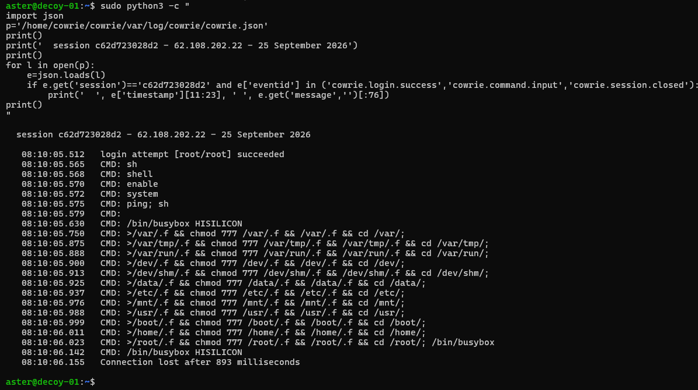

# First contact — 25 September 2026

The decoys became reachable from the internet at **08:01:20 UTC**. This note
records the first forty minutes, because the first day produced results the
remaining eleven weeks will be measured against.

## Summary

| | |
|---|---|
| Firewall opened | 08:01:20 UTC |
| First uninvited connection | 08:02:03 UTC — **43 seconds** |
| First successful login | 08:10:04 UTC — **8 min 44 s** |
| Credential guessed | `root` / `root` |
| Protocol | Telnet (port 23) in every case |
| Distinct sources in 40 minutes | 6 |
| SSH (port 22) arrivals | 0 |

## Timeline

```
08:02:03  165.22.18.23    connect, telnet
08:02:35  165.22.18.23    root / anko                    refused
08:03:02  165.22.18.23    enable\x00 / linuxshell\x00    refused
08:03:36  165.22.18.23    system\x00 / shell\x00         refused
08:04:53  165.22.18.23    admin / smcadmin               refused
08:07:45  42.180.13.250   connect — then 20 more, ~13s apart, no credentials
08:10:04  62.108.202.22   admin / admin                  refused
08:10:04  62.108.202.22   root / root                    ACCEPTED
08:15:40  92.53.214.135   root / root                    ACCEPTED
```

The refused credentials are not server credentials. `root/anko` is a DVR
default, `admin/smcadmin` an SMC router default, and the
`enable` / `system` / `shell` sequence is the console-escalation pattern used
against embedded busybox devices. All appear in the published Mirai credential
table — see *Caveats* on verifying this properly.

## What the successful session did

Session `c62d723028d2`, from `62.108.202.22`, lasted **893 milliseconds**.
The first four commands land three thousandths of a second apart. Not a person.

| Sent | Purpose |
|---|---|
| `sh` → `shell` → `enable` → `system` | Console-escalation ladder for embedded devices. On a real router or camera one of the four opens a shell. It tries all of them because it does not know what it has reached |
| `ping; sh` | Command-injection probe. If the device runs `ping` *and then* `sh`, its input handling is broken in a useful way |
| `/bin/busybox HISILICON` | Liveness check, and the clearest signature in the session. HiSilicon makes the chipset in most cheap IP cameras and DVRs. There is no `HISILICON` applet — the bot wants busybox's exact *applet not found* error, which proves busybox is real and the device genuine. It also serves as a marker separating stages |
| `/bin/busybox cat /proc/self/exe` | Reading its own binary to determine the CPU architecture, so it knows which build of the payload to fetch — MIPS, ARM or x86 |
| `>/var/.f && chmod 777 /var/.f && /var/.f && cd /var/;` and eleven variants | Hunting for one writable directory across `/var`, `/var/tmp`, `/var/run`, `/dev`, `/dev/shm`, `/data`, `/etc`, `/mnt`, `/usr`, `/boot`, `/home` and `/root`. Create a file, make it executable, try to run it. The first that works is where the payload lands |




## Two hosts, one script

At 08:15:40 a different address, `92.53.214.135`, ran the same sequence.
Cowrie hashes every terminal recording, and both hosts produced the same two
hashes:

```
52e9b844cab6d6b643be95b12df186d807af346df86502511b741a…
d4c6234f92f0927070bd79f204505347896699a0825457681216dd…
```

Byte-identical, five minutes apart, from unrelated addresses. This is the
clearest available evidence that the traffic is commodity automation rather
than anything directed at this machine — and it can be stated as a hash
rather than as an adjective.

## A third behaviour, distinct from both

`42.180.13.250` produced more than twenty connections roughly thirteen seconds
apart and **never attempted a credential**. Connection without credential
attempt is behaviourally different from brute force and should be counted
separately: it is consistent with port enumeration, or with a bot whose later
stages fail. Whatever it is, folding it into "login attempts" would overstate
brute-force volume.

## What it did not do

No payload was delivered. The most likely explanation is a failed liveness
check — the `HISILICON` response. This bounds what the dataset can support:
the decoy reliably captures reconnaissance and credential behaviour, and
captures payload delivery only sometimes. Any claim about what attackers
*install* must be qualified accordingly.

## What this changes for the analysis

The telnet door is not attracting people looking for a Linux server. It is
attracting automated hunting for **embedded devices** — the same category of
equipment as the industrial controllers behind the OT door. The project was
designed around an IT/OT split; there may be a third category sitting between
the two, and it was visible in the first four minutes.

## Caveats

- **Loopback is in the log.** Local testing produced `127.0.0.1` sessions on
  25 September. These are excluded at ingest, and the exclusion is stated
  rather than done silently.
- **`dst_ip` is `172.16.0.4`**, the machine's private address, because Azure
  translates. Identify the sensor by the `sensor` field, never by destination.
- **Credentials can contain null bytes** (`enable\x00`). They arrive as
  `\u0000` in the JSON and must reach the database unmangled. The raw line is
  retained so a parsing decision can be revisited.
- **Attribution is provisional.** The Mirai-family reading above is to be
  confirmed against
  [SecLists](https://github.com/danielmiessler/SecLists/blob/master/Passwords/Malware/mirai-botnet.txt)
  and the [published scanner source](https://github.com/jgamblin/Mirai-Source-Code/blob/master/mirai/bot/scanner.c),
  not asserted from familiarity.
- **Technique mapping is provisional:** T1110 brute force, T1059 command and
  scripting interpreter, T1082 system information discovery, T1083 file and
  directory discovery, and an attempted T1105 ingress tool transfer that did
  not complete. Confirm against the ATT&CK matrix before publishing.

## The telnet skew is real

Forty minutes, six sources, zero arrivals on port 22 — which could have meant
either that telnet is scanned far more aggressively, or that port 22 was not
actually reachable and half the intended comparison would quietly be empty.

Port 22 was tested from an external address the same morning and answered
correctly, landing in the imitation. The skew is therefore a property of the
traffic, not a fault in the instrument, and the comparison between the two IT
doors is itself a result: on day one, telnet drew every single arrival.

That test session appears in the log from the analyst's own address and is
excluded at ingest alongside loopback.
