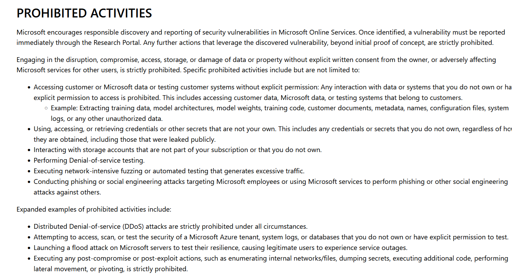
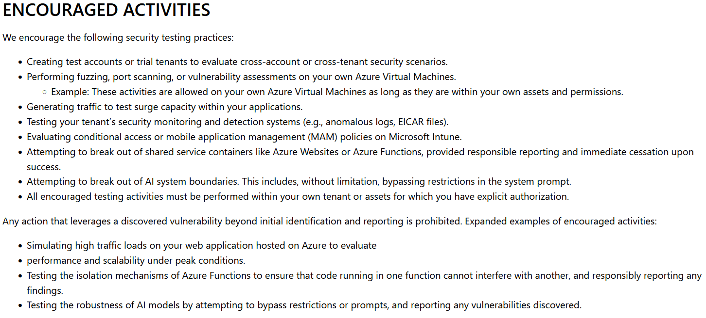

# Rules of engagement

What was checked before the machine was switched on, what it permits or encourages even, and
what are the limits of that permission. 

## The short version: passive reception ONLY

This project **only ever receives**. It never scans, never replies, never
probes anything, and never runs what is sent to it. 

## The provider's terms

The governing document for security work on Azure resources is Microsoft's
**Cloud Penetration Testing Rules of Engagement**. Version as on
[24/09/2026], and the two screenshots are saved in this folder

**What it prohibits** is, in substance, anything that reaches past your own
resources: touching assets or data belonging to other Microsoft customers,
denial-of-service testing, using Azure infrastructure to attack third
parties, social engineering of Microsoft staff, and pushing a found
vulnerability beyond proof of concept. This project does none of those. It
makes no outbound connections from the decoys at all.

**What it explicitly encourages** includes port scanning and vulnerability
scanning of *your own* Azure virtual machines. That is useful here: Microsoft 
expects customers to generate security-relevant traffic against their own 
machines, so verifying my own decoy ports from my own PC is allowed.

## Personal data

Source IP addresses are personal data under the GDPR, which applies here —
the operator is in Germany, the machine is in Austria. The position taken:

| | |
|---|---|
| What is collected | Source IP, timestamp, port, and the credentials or commands the sender chose to send |
| Why it is lawful to hold | Legitimate interest in the security of my own system, limited to what that interest needs |
| Minimisation | No attempt is made to identify any individual behind any address. Addresses are geolocated to country only. Besides, a lot (most?) of these machines are themselves compromised|
| Published form | Country and aggregate counts only. No individual address appears in this repository or in the presentation |
| Retention | Raw logs live only on the machine and are destroyed with it at teardown. The database copy retains what is needed for the written analysis |
| Never collected | Nothing is solicited from senders. No content is retrieved from them, no connection is made back to them |

## Rules: TL;DR

1. **Receive only.** No scan, no probe, no reply, no retaliation, ever, to
   any address that appears in the logs.
2. **Execute nothing.** Both decoys emulate services; neither runs uploaded
   code. Anything uploaded stays on disk, quarantined, and is destroyed with
   the machine.
3. **Commit no malware.** Upload directories are excluded in `.gitignore`
   before the decoys even exist
4. **Nothing borrowed.** No university, employer, ReDI School or third-party
   network or account is involved. One machine, rented in my own name, paid
   from my own student credit.
5. **Real admin access is separated from the decoys.** Administrative SSH
   sits on a high port restricted to one address; port 22 belongs to the
   decoy and nothing else.
6. **A fixed end date.** The machine is destroyed on 12 December 2026. An
   exposed machine that outlives its purpose is a liability, not an asset.

## If something goes wrong...

The realistic failure is a decoy being used as a stepping stone. The
detection is outbound traffic where there should be none, and the response is
to abandon ship: destroy the resource group immediately and write
up what happened afterwards. 
